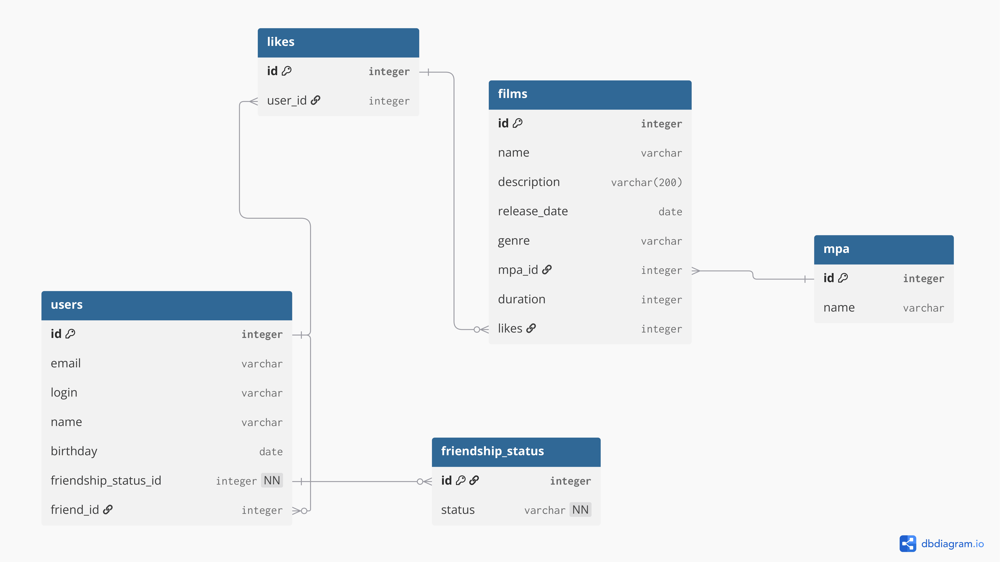

# java-filmorate
Болванка проекта рейтинговой платформы для сайтов Filmorate.


# Таблицы
- users (пользователи приложения: email, логин, имя, дата рождения, список друзей и статус подтверждения запроса на дружбу)
- films (фильмы: название, описание (не больше 200 символов), дата релиза, жанр, рейтинг MPA, продолжительность и список лайков)
- friendship_status (справочная таблица на статус дружбы)
- likes (список лайков)
- mpa (справочная таблица на список mpa)

# Примеры основных SQL-запросов
1. Добавление пользователя
```
INSERT INTO users (email, login, name, birthday, friendship_status_id)
VALUES ('user@mail.ru', 'user', 'User', '2005-05-27', 1);
```
2. Получение списка фильмов
```
SELECT f.*
FROM films f
JOIN mpa m ON f.mpa_id = m.id;
```
3. Обновление данных фильма
```
UPDATE films
SET name = 'Афёра',
    description = 'Папа иллюзии обмана',
    duration = 139
WHERE id = 1;
```
4. Добавление лайка
```
INSERT INTO likes (user_id)
VALUES (1);
```
